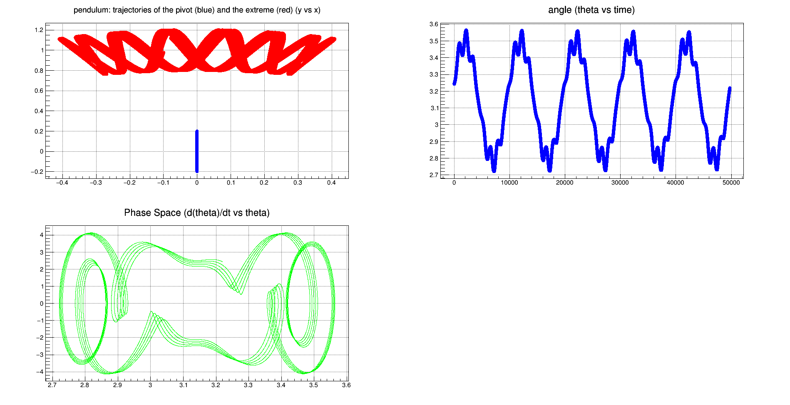

## Inverted pendulum stabilization

After having watched [this amazing video](https://www.youtube.com/watch?v=5oGYCxkgnHQ) about the stabilization of an inverted pendulum, I wanted to replicate the result using the Euler method to approximate the equation of motion of the pendulum. The coordinate system follows [this](https://upload.wikimedia.org/wikipedia/commons/b/b2/Simple_gravity_pendulum.svg) scheme.

ACHTUNG! This has been written by `past-me` in 2014, do not judge! I know that it is full of italian and that the parameter setting is awful, I know.



## Run and replicate the result

```bash
docker run \
  -v $PWD:/src \
  -v ~/temp/docker-root/:/root: \
  -e DISPLAY=$DISPLAY \
  -v /tmp/.X11-unix:/tmp/.X11-unix \
  --user (id -u):(id -g) \
  --rm -it \
  rootproject/root bash

g++ -o pend vect2d.cc bar.cc pend.cpp `root-config --cflags --glibs`
./pend

```

